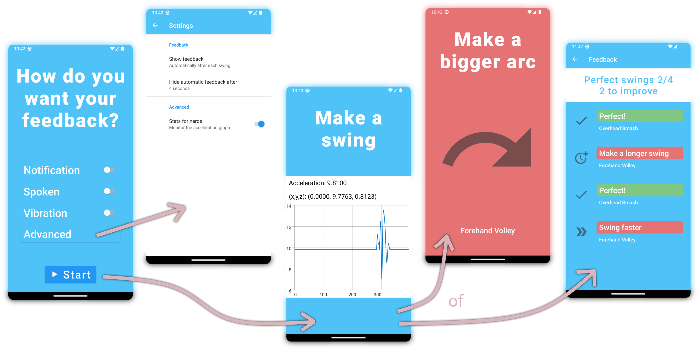

# Swing Coach

Hifi prototype Android app to demonstrate acceleration tracking (of a person's arm), extracting related info about the swing, and providing a.o. audible feedback.

## Run

Git clone and run in Android Studio.

## Development & Motivation

This app was made for a Human Computer Interaction project at university. After a design process, persona creation, and holding interviews, I became responsible for creating an intuitive hifi prototype with free choice of platforms and languages. I chose Android Studio because of some prior experience and the desire to deepen my knowledge of native mobile development. I opted for Kotlin over Java because of its elegance and modern features.

## App flow

The app waits until an arm movement is detected (the user holds the phone in their hand). The data of the acceleration sensor is analyzed, and feedback appears in the desired modality (see second picture from the right). The feedback disappears automatically, so the user can keep playing tennis without needing to interact with the app.

Instead of receiving feedback for each individual swing, the user can also manually stop the app to show feedback for all detected swings (see first picture from the right). This is useful if you only want to see the feedback after a set, for example. The graph, normally invisible, is for the sports nerds who want to see live acceleration data, and of course, this was also useful for development.

## Reflection

I learned to test an app with users, and to implement their feedback. I have also gained a deeper understanding of:
- Using sensor data
- Text-to-speech synthesis
- Notifications
- Sharing data between components
- Layout design

